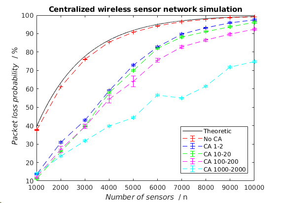
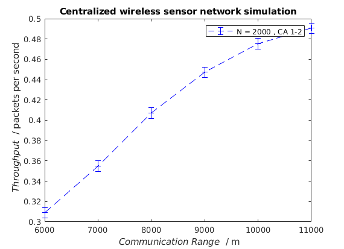

# Introduction

# Task 1

The purpose of this task is to create a practical simulation of a
large-scale wireless sensor network consisting of a number of
transmitting sensors bounded by an area. Each sensor communicates
through a gateway placed in the middle of the area that listens for any
transmitting packets. A sensor sleeps for a random time according to a
exponential distribution before it transmits it’s packet. The transmit
time is deterministic and the same for all transmissions and the
propagation time is neglected. If there are multiple sensors
transmitting to the gateway simultaneously a collision occurs that
invalidates the packet.

Each sensor has multiple parameters that will be alternated throughout
the assignment to investigate its effect on the system. These
configuration parameters are described in *Chapter 2.1* together with a
description of the simulation code. The resulting throughput and fail
probability rate are demonstrated in *Chapter 2.2* followed by a
discussion and conclusion in *Chapter 2.3*. The complete source code can
be found in *Appendix A* as a reference.

## Simulation

The simulation program is written in *Java* together with a small
*Bash*-script (*config.sh*) that helps
changing the configurations throughout the assignment. It modifies the
configuration parameters in a configuration file
(*config.properties*) which *Java*
program parses for its input variables. The *Bash*-script first compiles
the code, runs it with different parameters and ends with a small
clean-up routine.  
The following sensor parameters that affects the behaviour of the
system:

  - **MODE** - A sensor can operate
    in two different modes. Either in a direct way such that the sensor
    transmits a packet directly after it wakes up from sleep or by first
    sensing the channel to check if there’s any other sensors within
    range that is currently transmitting before it transmits. The
    simulated throughput of this method is tested against the well known
    result in *Equation 1.* If the sensors detects another transmitting
    sensors, it waits for random amount of time according to a uniformly
    distributed interval called the *back-off interval* before it tries
    to re-transmit.
    
    \[T_{put} = \lambda_{p}T_pe^{-2\lambda_pT_p}\]

  - **COMMUNICATIONRANGE** - Sets
    the communication range for a sensor. If a sensor is placed too far
    from a gateway, it won’t be able to get achieve successful
    transmissions. However, if the sensor operates in the *CA (Collision
    Avoidance)* mode, it could still trigger another sensors back-off
    time which.

  - **LOWLIMIT/UPLIMIT** - Sets the
    upper and lower bound for the uniformly distributed back-off time.

  - **MEANINTERARRIVALTIME** - Sets
    the mean sleep time for a sensor that follows a exponential
    distribution. The default value is set to
    *4000* seconds.

  - **TRANSMITTIME** - Sets the
    time it takes for a sensor to transmit a package to the gateway. The
    default value is set to *1*
    second.

In addition, there are some parameters that affects the network setting,
these are:

  - **AREAHEIGHT** - Sets the
    height of the area in meters. The default value is set to
    *10000* meters.

  - **AREAWIDTH** - Sets the width
    of the area in meters. The default value is set to
    *10000* meters.

  - **NOSENSORS** - Sets the number
    of sensors that should be uniformly randomly distributed on the
    area. The default value is set to
    1000 sensors.

  - **CONTROLTIME** - The gateway
    is the logical object that controls if there are any concurrent
    transmission that may cause collisions. The control time parameter
    sets the resolution for the time between these controls. It should
    be adjusted to the value of
    TRANSMITTIME so that it isn’t
    to large in that it would miss potential collisions and neither to
    big in that it would congest the signal list and impair the
    simulation performance. The default value is *1/10th* of the
    transmit time, i.e. *0.1* seconds.

Lastly, there are three parameters that will affect the measurement
output of the simulation, these are:

  - **STDDEVSTOPCONDITION** - Sets
    the standard deviation of the sampled average values that is needed
    in order to stop the simulation, i.e. the simulation will not stop
    until this condition is fulfilled. The default value of this
    parameter needs to be adjusted to the value that is being measured.
    In general it should be chosen so that the confidence intervals over
    different simulation doesn’t overlap.

  - **MEANSAMPLETIME** - Sets the
    mean time between output samples. The sampling time is uniformly
    distributed where the mean is reflected by this value. The default
    value is set to *100* seconds.

  - **CONFIDENCELEVEL** - Sets the
    confidence level used to output the confidence level of the sampled
    averages. The default value is set to
    *99.0 %*.

Some general notes regarding the program is that it is implemented with
the *"Process Interaction"* discrete event simulation approach due to
the rather large scale of the problem. This approach is less
computational resourceful and thus suits this type of problem better
than other approaches e.g. the *"Event Scheduling* approach.
Furthermore, the program is implemented with only two communicating
objects: the *Sensor.class* and
*Gateway.class*, together with a system
class *NetworkArea.class* that
distributes the objects on the network area, applies the configuration
parameters to the objects and initializes the discrete event logic of
the simulation. One benefit of having it divided like that is that
several areas with different sizes, different number of sensors and
gateways with different positions could be running from the same main
program. Large scale simulations could then make use of multiple threads
to simulate these areas concurrently. *Figure* [1](#fig:resource) shows
the CPU utilization per core during one simulation run and from this it
could concluded that the performance could largely benefit from
multi-core utilization since only one core is cranked to *100%* in its
current implementation.

There are some limitations of this approach in it’s current
implementations that restricts the use of multiple gateways per areas
and overlapping areas, e.g. a sensor or gateway from one area cannot
interact with another sensor or gateway from another area. That is
because each area is tied to one gateway. On the contrary, the same
scenario would apply in some real world scenarios, such as sensors that
connects to a *access point* only when it knows its *SSID* and
cryptographic *password.* The difference is that that the simulation is
static so that each sensor is tied to one gateway for the entire
duration of the simulation.

## Results

## Conclusion

The average throughput for different simulation modes with default
settings, see *chapter 2.1*, for different number of deployed sensors
are shown in *Figure* [2](#fig:throughput). It is evident that the
results from the first simulation mode (*red*) aligns with the theoretic
expected result originating from *Equation 1* with some minor error and
non-overlapping confidence intervals. The fact that the throughput
decreases as the number of deployed sensors increases also conforms the
expectations. Additionally, the results for the second collision
avoidance mode demonstrates that the use of collision avoidance
increases the throughput for all back-off intervals in the results. Even
if the results are similar for all three of *CA 1-2*, *CA 10-20* and *CA
100-200*, *CA 100-200* seems to achieve the most robust performance as
the number of deployed sensors grow over *5000*. The biggest benefit of
the *CA mode* seems to occur when there are around *3000* and *4000*.
The optimal back-off time interval both depends on the number of
deployed sensors, the mean sleep time and the transmission time, further
simulation analysis could therefore be made in order to optimize the
back-off off time for some custom setting using linear programming,
heuristics or meta-heuristics.  
Continuing with packet loss probability results in Figure
[3](#fig:failprob), it is again evident that the simulation results
aligns with the theoretic expectations. The results also matches the
results from the throughput, i.e. when the number of sensors goes beyond
*4000 - 5000* the performance starts to decrease and asymptotically
going towards a congested network with *0* throughput and *100%* packet
loss probability. Similarly, the CA mode seems to coincide with the
throughput results such that the throughput performance increases and
the packet loss probability decreases as the number of deployed sensors
grow. Because of the confidence intervals for *CA 1-2*, *CA 10-20* and
*CA 100-200* overlaps for *N = 1000, 2000, 3000* it’s statistically non
feasible to determine the optimal back-off time. Connecting to the
conclusions from the throughput results weakens the conclusion that *CA
100-200* achieves the best performance among those three modes. The *CA
1000-2000* mode however, achieves the best performance when *N \> 5000*
compared with the other modes.

The effect of the sensor communication range can be seen in *Figure*
[4](#fig:radii) with *2000* sensors set in the *CA 1-2* mode for each
simulation. Starting with *6 km* range, a slight decrease in average
throughput can be seen caused by the fact that a bigger portion of
sensors gets deployed out of reach of the gateway which results in a
general decrease in performance. The throughput then seems to grow
logarithmic as the communication range increases since each sensor has
the ability to seek a bigger part of the communication range before it
transmits. It will however reach a maximum at \(N ~ 14 km\) since two
sensors placed at each side of the diagonal has the possibility to sense
each others transmissions, which would correspond to the "worst" case.
